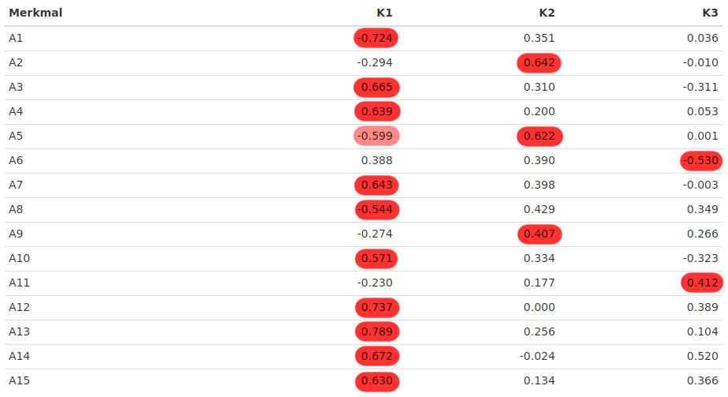
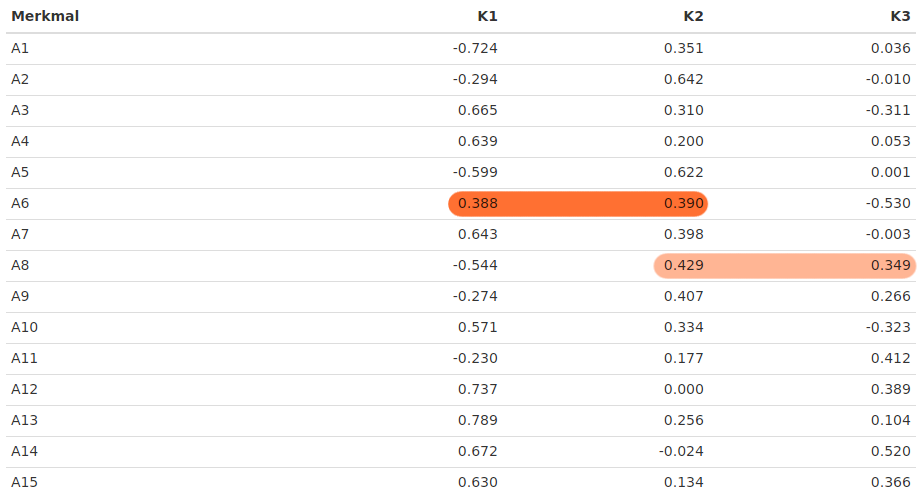

```{r setup, include=FALSE}
knitr::opts_chunk$set(fig.path = "assets/plots/", fig.align = "center", 
                      fig.retina = 2, echo = F, warning = F, message = F)
library(sjPlot)
library(sjmisc)
library(dplyr)
library(knitr)
library(ggplot2)
library(tadaatoolbox)
library(magrittr)
library(car)
library(htmlTable)
library(tidyr)

# NGO & FKV Datensatz einlesen
fkv   <- haven::read_sav("./data/fkv.sav")
zombo <- readRDS("./data/zombo.rds")
data(ngo)

# 3 digits are enough
options(digits = 3)

# selfmade ggplot-Theme laden und global setzen
source("./assets/theme_tut.R")
theme_set(theme_readthedown(base_size = 16))
```

# Na, auch hier?

##

- Slides: https://link.jemu.name/qmpW17
- Alles auf einmal: https://link.jemu.name/qmpW17w
- Langer Link: https://public.tadaa-data.de/QM/pruefungstutorien/qm1_wise_17/

## Agenda

1. Aufgaben besprechen
2. Fragen klären
3. Angrenzende Theorie besprechen

## Erfahrungsgemäß reicht die Zeit …  

> - … **entweder** für alle **Aufgaben**…  
> - … **oder** für alle **Fragen**.  

<p class="fragment">Choose wisely.</p>

# Aufgabe 1 <br><br> Faktorenanalyse

##

Im Rahmen einer Hauptkomponentenanalyse wurde die folgende Komponenten-Matrix ermittelt:


```{r A01_data, echo = F}
a01 <- data.frame(
      Merkmal = paste0("A", 1:15),
           K1 = c(-.724, -.294, .665, .639, -.599, .388, .643, -.544,
                  -.274, .571, -.230, .737, .789, .672, .630),
           K2 = c(.351, .642, .310, .2, .622, .39, .398, .429, .407, .334, 
                  .177, 0, .256, -.024, .134),
           K3 = c(.036, -.01, -.311, .053, .001, -.530, -.003, .349, .266,
                  -.323, .412, .389, .104, .520, .366)
      ) 
```

## Beantworten Sie folgende Fragen

a) Was bedeuten die drei Werte innerhalb der zweiten Zeile?
b) Wie groß ist die Kommunalität des durch „A10“ gekennzeichneten Merkmals?
c) Welchen Wert besitzt der drittgrößte Eigenwert?
d) Wie viel Prozent der Gesamtvarianz aller 15 in die Faktorenanalyse einbezogenen (standardisierten) Merkmale wird durch den 3. Faktor erklärt?
e) Warum enthält die Komponenten-Matrix vermutlich nur drei Spalten?
f) Auf welche Faktoren laden die durch „A1“ bis „A15“ gekennzeichneten Merkmale jeweils am höchsten?
g) Gibt es bei den - im Rahmen der Suche nach einer Einfachstruktur - innerhalb von „6)“ vorgenommenen Zuordnungen an irgendeiner Stelle ein Problem, sodass es sinnvoll erscheinen könnte, eine Rotation durchzuführen?

##

Was bedeuten die drei Werte innerhalb der zweiten Zeile?

```{r A01_a}
cols <- with(a01, ifelse(Merkmal == "A2", '#58FF4F', 'white'))

htmlTable(as.matrix(a01[c(1:5),]), col.rgroup = cols)
```

##

Wie groß ist die Kommunalität des durch „A10“ gekennzeichneten Merkmals?

```{r A01_b}
htmlTable(as.matrix(a01[c(9:12),]), col.rgroup = cols)
```

<p class="fragment">$$0.571^2 +  0.334^2 - 0.323^2 \approx 0.333$$</p>


## Welchen Wert besitzt der drittgrößte Eigenwert?

Faktor 1 | Faktor 2 | Faktor 3 
---------|----------|---------
`r sum(a01$K1^2)` | `r sum(a01$K2^2)` | `r sum(a01$K3^2)`


##

Wie viel Prozent der Gesamtvarianz aller 15 in die Faktorenanalyse einbezogenen (standardisierten) Merkmale wird durch den 3. Faktor erklärt?

<p class="fragment">$$0.036^2 - 0.1^2 - 0.311^2 + 0.053^2 + \ldots = `r sum(a01$K3^2)`$$</p>

##

Warum enthält die Komponenten-Matrix vermutlich nur drei Spalten?  
Auf welche Faktoren laden die durch „A1“ bis „A15“ gekennzeichneten Merkmale jeweils am höchsten?


##

Auf welche Faktoren laden die durch „A1“ bis „A15“ gekennzeichneten Merkmale jeweils am höchsten?



##

Gibt es bei den - im Rahmen der Suche nach einer Einfachstruktur - innerhalb von „6)“ vorgenommenen Zuordnungen an irgendeiner Stelle ein Problem, sodass es sinnvoll erscheinen könnte, eine Rotation durchzuführen?


  
# Aufgabe 2 <br /><br />Faktorenanalyse… Nochmal

##

Schauen Sie sich den **FKV** Fragebogen an und überlegen Sie, welche Items zu welchem Faktor zusammengefasst werden könnten. Führen Sie anschließend eine **Hauptkomponentenanalyse** für den FKV- Datensatz durch. Prüfen Sie, welche Faktoren Sie zuvor inhaltlich angedacht hatten und welche Faktoren die Testautoren benannt haben (siehe Folie der letzten Veranstaltung). Stimmen die statistischen Daten damit überein?

# Aufgabe 3 <br /><br />Variabilität

##

Sie haben Werte des Merkmals „**Unterrichtsstunden**“ u.a. zur Berechnung der Variabilitätsmaße und Zentralmaße verwendet. Reflektieren Sie die Zentral- und Variabilitätsmaße. Sind alle Statistiken gut geeignet?

## Mittelwert, Median, Modus

$$\bar{x} = \frac{1}{n} \sum^n_i x_i \approx \underline{`r round(mean(ngo$stunzahl), 3)`}$$

```{r a03, eval = T}
mvalues <- data.frame(Zentralmaß = factor(c("Mittelwert", "Median", "Modus")),
                      Wert = as.numeric(c(mean(ngo$stunzahl), median(ngo$stunzahl), modus(ngo$stunzahl))))

ggplot() +
  geom_histogram(data = ngo, aes(x = stunzahl), binwidth = 1, alpha = .7) +
  geom_vline(data = mvalues, aes(xintercept = Wert, color = Zentralmaß), size = 2) +
  labs(x = "Unterrichtsstunden", y = "Häufigkeit")
```

## Varia…tions…abweichung…dings

<div class = "fragment">
**Variation**

$$\sum^n_{i=1} (x_i - \bar{x})^2 \approx \underline{`r round(var(ngo$stunzahl) * (length(ngo$stunzahl) - 1), 3)`}$$
</div>
<div class = "fragment">
**Varianz**

$${S_x}^2 = \frac{1}{n-1} \sum^n_{i=1} (x_i - \bar{x})^2 \approx \underline{`r round(var(ngo$stunzahl), 3)`}$$
</div>
<div class = "fragment">
**Standardabweichung**

$$S_x = \sqrt{\frac{1}{n-1} \sum^n_{i=1} (x_i - \bar{x})^2} \approx \underline{`r round(sd(ngo$stunzahl), 3)`}$$
</div>

# Aufgabe 4 <br /><br />Standardabweichung

##

Sie haben folgende Zahlen vorliegen: **7, 9, 10, 11, 11, 14, 15, 16**.  
Berechnen Sie für diese Werte die Standardabweichung per Hand.

**Standardabweichung** $(S_x$ bzw. $\sigma)$: 

<div class = "fragment">
$$S_x = \sqrt{\frac{1}{n-1} \sum^n_{i = 1} (x_i - \bar{x})^2}$$
</div>
<span class = "fragment">$\bar{x} = 11.625 \quad \quad n = 8$</span>
<div class = "fragment">
$$
\begin{aligned}
S_x &= \sqrt{\frac{1}{8-1} \cdot \left((7-11.625)^2 + \ldots + (16-11.625)^2\right)} \\
&= \sqrt{\frac{1}{7} \cdot (21.39 + 6.89 + \ldots + 19.14)} \\
&= \sqrt{\frac{1}{7} \cdot 67.875} \\ 
&= \sqrt{9.696} \approx \underline{3.114}
\end{aligned}
$$
</div>

# Aufgabe 5 <br /><br />z-Standardisierung

##

Berechnen Sie für die Werte 23, 27 und 31 von „stunzahl“ (Auswahl der Schülerinnen der 13. Klasse) die standardisierten Werte per Hand.

```{r a05}
values <- ngo %>% filter(jahrgang == "13", geschl == "Weiblich") %>% 
  summarize(mean = mean(stunzahl), sd = sd(stunzahl))
```

<div class = "fragment">
**z-Standardisierung**: 
<br /><br/ > 
$$
z = \frac{x - \text{Zentrum}}{\text{Dispersion}} \longleftrightarrow 
z = \frac{x - \mu}{\sigma} \longleftrightarrow 
z_i = \frac{x_i - \bar{x}}{S_x}
$$
</div>

<div class = "fragment">$\bar{x} \approx `r values$mean` \quad\quad S_x \approx `r values$sd`$</div>
<br />
<div class = "fragment">$23 \rightarrow \frac{23 - 29.52}{5.78} \approx \underline{-1.13}$</div>
<br />
<div class = "fragment">$27 \rightarrow \frac{27 - 29.52}{5.78} \approx \underline{-0.44}$</div>
<br />
<div class = "fragment">$31 \rightarrow \frac{31 - 29.52}{5.78} \approx \underline{0.26}$</div>
<br />

# Aufgabe 6 <br /><br />Normalverteilung

##

Ein Merkmal ist $\mathcal{N}(3, 2)$ - verteilt. Berechnen Sie die Wahrscheinlichkeit dafür, dass Merkmalsträger Werte zwischen **2** und **4.5** besitzen und die Wahrscheinlichkeit dafür, dass Merkmalsträger Werte besitzen, die kleiner als **4** sind.  
<small>(Anmerkung: Sollte in der Klausur eine solche Frage auftauchen, erhalten Sie eine Standardnormalverteilungstabelle)</small>

## Refresher: Normalverteilung

$$\mathcal{N}(\mu, \sigma) := \frac{1}{\sqrt{2\sigma^2\pi} } \; e^{ -\frac{(x-\mu)^2}{2\sigma^2} }$$

```{r a06_normplot}
label_norm <- function(x) {
  if (length(x) > 1) {
    return(sapply(x, label_norm))
  }
  if (x != 0) {
    if (abs(x) == 1) {
      return(paste0(sub("1", "", sign(x)), "σ"))
    } else {
      return(paste0(x, "σ"))
    }
  } else {
    return("µ")
  }
}

ggplot(data = NULL, aes(x = -4:4)) + 
  stat_function(fun = dnorm) +
  geom_area(aes(x = seq(-3, 3, .1), y = dnorm(seq(-3, 3, .1))), fill = "gray", alpha = .5) +
  geom_area(aes(x = seq(-2, 2, .1), y = dnorm(seq(-2, 2, .1))), fill = "gray", alpha = .5) +
  geom_area(aes(x = seq(-1, 1, .1), y = dnorm(seq(-1, 1, .1))), fill = "gray", alpha = .5) +
  scale_x_continuous(breaks = seq(-4, 4, 1), labels = label_norm) + 
  labs(x = "x", y = expression(P(x)), title = expression(N(mu, sigma))) + 
  theme(panel.grid.major = element_line(size = 0.1), 
        panel.grid.minor = element_line(linetype = "blank"),
        axis.text.x = element_text(size = rel(2)),
        axis.text.y = element_blank(),
        axis.ticks.y = element_blank())
```

## $\mathcal{N}(3, 2)$— $[2, 4.5]$

```{r a2_norm_teil1}
ggplot(data = NULL, aes(x = -4:10)) + 
  stat_function(fun = dnorm, args = list(mean = 3, sd = 2)) +
  geom_area(aes(x = seq(2, 4.5, .1), y = dnorm(seq(2, 4.5, .1), 3, 2)), fill = "gray", alpha = .75) +
  scale_x_continuous(breaks = seq(-4, 10, 1)) + 
  labs(x = "x", y = expression(P(x)), title = expression(N(3, 2))) + 
  theme(panel.grid.major = element_line(size = 0.1), 
        panel.grid.minor = element_line(linetype = "blank"),
        axis.text.x = element_text(size = rel(1.3)),
        axis.text.y = element_blank(),
        axis.ticks.y = element_blank())
```

## "Kann man das ausrechnen?"

<span class = "fragment"> Well… </span>

<div class = "fragment">
I dare you.

$$\int_2^{4.5} \frac{1}{\sqrt{2\sigma^2\pi} } \; e^{ -\frac{(x-\mu)^2}{2\sigma^2} } dx$$
</div>

<div class = "fragment">
### in R

- `pnorm(x, mean = m, sd = s)` $= prob(-\infty, x)$ für $\mathcal{N}(m, s)$
- `pnorm(4.5, 3, 2) - pnorm(2, 3, 2)`
</div>

## Oder für Humanwissenschaftler\*innen…

>- Werte z-Standardisieren: 
>- $\frac{2-3}{4.5} = -0.5$
>- $\frac{4.5-3}{4.5} = 0.75$
>- In SNV-Tabelle nachgucken…
>- Arithmetik
>- Boom: $\underline{0.465}$

## $\mathcal{N}(3, 2)$ — $(-\infty, 4]$

```{r a2_norm_teil2}
ggplot(data = NULL, aes(x = -4:10)) + 
  stat_function(fun = dnorm, args = list(mean = 3, sd = 2)) +
  geom_area(aes(x = seq(-4, 4, .1), y = dnorm(seq(-4, 4, .1), 3, 2)), fill = "gray", alpha = .75) +
  scale_x_continuous(breaks = seq(-4, 10, 1)) + 
  labs(x = "x", y = expression(P(x)), title = expression(N(3, 2))) + 
  theme(panel.grid.major = element_line(size = 0.1), 
        panel.grid.minor = element_line(linetype = "blank"),
        axis.text.x = element_text(size = rel(1.3)),
        axis.text.y = element_blank(),
        axis.ticks.y = element_blank())
```

You get the idea.

# Aufgabe 7 <br /><br />z-Standardisierung<br /><small>Schon wieder</small>

##

Eine Person hat in drei Tests (T1, T2 und T3) folgende drei Punktzahlen erreicht:

$$T1=10 \quad T2=10 \quad T3=10$$
  
Als Mittelwert wurde für T1 der Wert 10, für T2 der Wert 15 und für T3 der Wert 20 ermittelt. Die Standardabweichungen betragen bei T1=2, T2=1 und bei T3=1,5.

a) In welchem der Tests hat die Person am besten abgeschnitten? Und warum?
b) Welchen Wert könnte man der Person als Gesamttestwert sinnvoll zuordnen?  
Und welche Informationen sind wichtig für Sie, um eine geeignete Zuordnung zu wählen?

## Oh glob so langweilig

<div class = "fragment">
### Test 1

$$\bar{x} = 10  \qquad S_x = 2 \qquad z \frac{10 - 10}{2} = \underline{0}$$
</div><div class = "fragment">
### Test 2

$$\bar{x} = 15  \qquad S_x = 1 \qquad z \frac{10 - 15}{1} = \underline{-5}$$
</div><div class = "fragment">
### Test 3

$$\bar{x} = 20  \qquad S_x = 1.5 \qquad z = \frac{10 - 20}{1.5} = \underline{-6.\bar{6}}$$
</div>

# Aufgabe 8 <br /><br />$\chi^2$, $C$, Cramer's $V$

##

Erstellen Sie eine Kontingenztabelle mit dem Zeilenmerkmal „abschalt“ (Abschalten“) und dem Spaltenmerkmal „jahrgang“ („Jahrgangsstufe“). Berechnen Sie die Indifferenztabelle und den $\chi^2$ Wert sowie $C$ und $V$ per Hand.  
Interpretieren Sie diese Ergebnisse.

## Kontingenztabelle

```{r a08}
t_8 <- sjt.xtab(ngo$abschalt, ngo$jahrgang, 
               show.exp = T,
               show.legend = T,
               use.viewer = F, no.output = T)
```

`r t_8$knitr`

## To the math! /o/

<div id = "left">

`r t_8$knitr`
</div>
<div id = "right">
<div class = "fragment">
\[\begin{aligned}
\chi^2 &= \sum_{\text{Alle Zellen}} \frac{(f_b - f_e)^2}{f_e} \\
 &= \frac{(57 - 54)^2}{54} + \ldots + \frac{(22 - 22)^2}{22} \\
 &= 0.167 + \ldots + 0 \approx \underline{0.544}
\end{aligned}\]

<br />

<div class = "fragment">
\[\begin{aligned}
\text{Cramer's}\ V & = \sqrt{\frac{\chi^2}{n \cdot min(r-1, c-1)}} \\
                  & = \sqrt{\frac{0.544}{246 \cdot 2}} \approx \underline{0.047}
\end{aligned}\]
</div>
</div>
</div>

## Kontingenzkoeffizient $C$

<small>Die bucklige Verwandschaft</small>

<div class = "fragment">
$$C = \sqrt{\frac{\chi^2}{\chi^2 + n}} = \sqrt{\frac{0.544}{0.544 + 246}} \approx \underline{0.002}$$
</div>
<span class = "fragment">Und dann noch irgendwas mit $C_{\text{max}}$ und $C_{\text{korr}}$ …?</span>

<div class = "fragment">
<div id = "left" class = "fragment">
$$
\begin{aligned}
C_{\text{max}} &= \sqrt{\frac{r-1}{r}} \\
&= \sqrt{\frac{2}{3}} \\\\
&\approx \underline{0.816}
\end{aligned}
$$
</div>
<div id = "right" class = "fragment">
$$
\begin{aligned}
C_{\text{korr}} &= \frac{C}{C_{\text{max}}} \\
&= \frac{0.002}{0.816} \\\\
&\approx \underline{0.0025}
\end{aligned}
$$
</div>
</div>

# Aufgabe 9 <br /><br />Ordinalskalierte Statistiken

```{r a_09_01}
ngo %<>% mutate(
  begabung_k = cut(begabung, c(-Inf, 3, 6, Inf), c(1:3))
)

a09_sjt <- sjt.xtab(ngo$begabung_k, ngo$jahrgang, 
                    var.labels = c("Begabung (klassiert)", "Jahrgang"),
                    show.row.prc = F, show.exp = F, show.legend = F, show.summary = F,
                    use.viewer = F, no.output = T)
```

##

Sie haben die Werte der Variablen „Begabung“ klassiert, indem die Werte _1, 2 und 3_ in den neuen Wert **1**, die Werte _4, 5 und 6_ in den neuen Wert **2** und die Werte _7, 8 und 9_ in den neuen Wert **3** rekodiert wurden.

Berechnen Sie auf Basis einer Kontingenztabelle der rekodierten Variablen „Begabung“ und „Jahrgang“ Folgendes per Hand:

a) Die Anzahl der **konkordanten** Paare
b) Die Anzahl der **diskordanten** Paare
c) Die Anzahl der **Bindungen**
d) Welche Schlüsse kann man nur aufgrund 1-3) bzgl. der statistischen Beziehung ziehen?
e) Berechnen Sie aufgrund 1) und 2) den Wert für Gamma. Besteht ein statistischer Zusammenhang? 
f) Wäre eine andere Statistik geeigneter?

## 

<div class="col2">
`r a09_sjt$knitr`

<br /><br />

Bindungen (horizontal):
<div class = "fragment">
$$
\begin{align}
t &= (1  \cdot (0  + 0))  + (0  \cdot 0) \\
& + (63 \cdot (46 + 26)) + (46 \cdot 26) \\
& + (36 \cdot (54 + 24)) + (54 \cdot 24) \\\\
& = \underline{9836}
\end{align}
$$
</div>
</div>


<div class="col2">
Konkordante Paare:
<div class = "fragment">
$$
\begin{align}
N_c &= (1  \cdot (46 + 26 + 54 + 24)) \\
&+ (0  \cdot (26 + 24))  \\
&+ (63 \cdot (54 + 24))  \\
&+ (46 \cdot 24)         \\\\
& = \underline{6168}
\end{align}
$$
</div>

Diskordante Paare: 
<div class = "fragment">
$$
\begin{align}
N_d &= (0 \cdot (63 + 46 + 36 + 54))  \\
&+ (0  \cdot (63 + 36)) \\
&+ (26 \cdot (36 + 54)) \\
&+ (46 \cdot 36)        \\\\  
& =  \underline{3996}
\end{align}
$$
</div>
</div>

## $\gamma$ und Somers' $d$

<div id = "left" class = "fragment">
$$
\begin{aligned}
\gamma & = \frac{N_c - N_d}{N_c + N_d} \\\\
& = \frac{6168 - 3996}{6168 + 3996} \\\\
& = \frac{2172}{10164} \\\\
& \approx \underline{0.214}
\end{aligned}
$$
</div>

<div id = "right" class = "fragment">
$$
\begin{aligned}
\text{Somers' } d & = \frac{N_c - N_d}{N_c + N_d + t} \\\\
& = \frac{6168 - 3996}{6168 + 3996 + 9836} \\\\
& = \frac{2172}{20000} \\\\
& \approx \underline{0.109}
\end{aligned}
$$
</div>

<span class = "fragment">
\*GASP*\! Damit konnte ja niemand rechnen!
</span>

## Tau A 

$$
\begin{aligned}
\tau_a &= \dfrac{N_c - N_d}{\dfrac{(n-1) \cdot n}{2}} \\\\
&= \frac{6168 - 3996}{\dfrac{249 \cdot 250}{2}} \\\\
&= \ldots
\end{aligned}
$$

<div class = "fragment">NO WAIT!<br />Was ist das Problem?</span>

## Tau B

$$
\begin{aligned}
\tau_b &= \frac{N_c - N_d}{\sqrt{(N_c + N_d + t_x)(N_c + N_d + t_y)}} \\\\
&= \frac{6168 - 3996}{\sqrt{(10164 + 9836)(10164 + 5475)}} \\\\
&\approx \underline{0.123}
\end{aligned}
$$

<div class = "fragment">Wenigstens durften wir's anwenden ¯\\\_(ツ)_/¯</span>

## Tau C

$$
\begin{aligned}
\tau_c &= \dfrac{N_c - N_d}{\dfrac{1}{2} \cdot n^2 \cdot \dfrac{m-1}{m}} \quad |\ m = min(r-1, c-1) \\\\
&= \dfrac{6168 - 3996}{\dfrac{1}{2} \cdot 250^2 \cdot \dfrac{3-1}{3}} \\\\
&= \ldots
\end{aligned}
$$

<div class = "fragment">NO WAIT!<br />Was ist das Problem?</span>

# Aufgabe 10 <br /><br />Regression

## Beantworten Sie folgende Fragen:

a) Was versteht man unter einem Residuum, der Niveaukonstante und dem Steigungskoeffizienten?
b) Welche formale Beziehung besteht zwischen der Kovarianz und dem Steigungskoeffizienten?
c) Was bedeutet es, wenn die Regressionsgerade parallel zur X-Achse verläuft?
d) Welche Eigenschaften besitzt die Regressionsgerade?

## Wie geht so 'ne Regression?

Unser Modell: $$y = a + bx$$ bzw $$y = a + bx + e$$

Regressionsgerade: $$y' = a + bx$$

> - $y$ = Der Wert, den wir voraussagen wollen
> - $y'$ = Der y-Wert der Regressionsgeraden (_Prognosewert_)
> - $x$ = Den kennen wir schon  
> - $a$ = Der $y$-Wert bei $x = 0$ (_Niveaukonstante_)
> - $b$ = Der Wert, um den sich $y$ verändert, wenn sich $x$ um 1 erhöht (_Steigungskoeffizient_)  
> - $e$ = Der vertikale Abstand zur Regressionsgeraden (_Residuum_)

## Beispiel gefällig?

```{r a10_01, echo=F, fig.height=7, fig.width=12}
ggplot(zombo, aes(x = Skill_03, y = Skill_08)) +
  geom_ribbon(aes(x = seq(2, 3, 0.009434067), ymin = 3.1189,
                  ymax = seq(3.1189, 3.826, 0.006670755)),
              fill = "blue", alpha = 0.3) +
  geom_hline(yintercept = mean(zombo$Skill_08, na.rm = T), linetype = "longdash", color = "green") +
  geom_vline(xintercept = mean(zombo$Skill_03, na.rm = T), linetype = "longdash", color = "green") +
  geom_jitter(color = "black", alpha = 0.7, height = .3, width = .3, size = 1.5) +
  geom_smooth(method = "lm", se = F, color = "red", size = 1, fullrange = T) +
  scale_x_continuous(breaks = seq(0, 10, 2), minor_breaks = 1:10, limits = c(0, 10)) +
  scale_y_continuous(breaks = seq(0, 10, 2), minor_breaks = 1:10, limits = c(0, 10)) +
  labs(title = "Zusammenhang zwischen körperlicher Fitness und Ausdauer",
       subtitle = paste("r =", round(cor(zombo$Skill_08, 
                                         zombo$Skill_03, 
                                         use = "complete.obs"), 2),
                        "| a = 1.71 | b = 0.71"),
       x = get_label(zombo$Skill_03),
       y = get_label(zombo$Skill_08)) +
  theme_readthedown(base_size = 20)
```

# Aufgabe 11 <br /><br />Korrelationskoeffizient $r$

```{r a11_01}
a11 <- data.frame(
  ID = factor(c(1:5)),
  T1 = c(120, 95, 100, 110, 90),
  T2 = c(110, 90, 110, 115, 100)
)
```

##

Geben Sie die Formel des Korrelationskoeffizienten von Pearson an. Reflektieren Sie nochmals die Herleitung. Berechnen Sie die Korrelation aus folgenden Diät-Daten von Männern:

- Gewicht erster Messzeitpunkt: **120, 95, 100, 110, 90**  
- Gewicht zweiter Messzeitpunkt: **110, 90, 110, 115, 100**

## Also ungefähr so…

```{r a11_02a}
a11 %>% 
  ggplot(aes(x = T1, y = T2)) +
    geom_point(size = 3) +
    labs(x = "Gewicht (in kg) zu Messzeitpunkt 1",
         y = "Gewicht (in kg) zu Messzeitpunkt 2")
```

## …Oder besser so?

```{r a11_02b}
a11 %>% 
  gather(Zeitpunkt, Gewicht, T1, T2) %>% 
  ggplot(aes(x = Zeitpunkt, y = Gewicht, group = ID, color = ID)) +
    geom_line() +
    geom_jitter(width = .02, height = 0, size = 3) +
    scale_color_brewer(palette = "Set1") +
    labs(y = "Gewicht (in kg)") +
    theme(legend.position = "none")
```

## Pearson's $r$

<div class = "fragment">
In kurz:

$$r = \frac { s_{x, y} }{ s_{x} \cdot s_{y} }$$
</div>
<div class = "fragment">
In lang:

$$ r = \frac 
        { \frac{1}{n-1} \sum_{i=1}^n  \left( y_{i} - \bar{y}\right) \left( x_{i} - \bar{x}\right)}
        { \sqrt{\frac{1}{n-1} \sum_{i=1}^n\frac {\left( {x_i} - \bar{x} \right)^2}{n-1}} 
          \cdot 
          \sqrt{\frac{1}{n-1} \sum_{i=1}^n \frac {\left( {y_i} - \bar{y} \right)^2}{n-1}}}$$
</div>

## Kurzer Abstecher: Eta $\eta^2$

<div>
<div id = "left" class = "fragment">
$Y$-Variation in Gruppe $j$  
$$
\sum^{n_j}_{i=1} \left(y_{j,i} - \bar{y}_j\right)^2
$$
</div>

<div id = "left" class = "fragment">
Gesamtvariation von $Y$
$$
\sum^n_{i=1} (y_i - \bar{y})^2 = 
\sum^k_{j=1}\sum^{n_j}_{i=1} \left(y_{j,i} - \bar{y}\right)^2
$$
</div></div>
<br /><br />
<div class = "fragment">
$$
\eta^2 = \frac{\sum^{n_j}_{i=1} \left(y_{j,i} - \bar{y}_j\right)^2 - \sum^k_{j=1}\sum^{n_j}_{i=1} \left(y_{j,i} - \bar{y}_j\right)^2}{\sum^{n_j}_{i=1} \left(y_{j,i} - \bar{y}_j\right)^2}
$$
<br />
$$
\left(\text{PRE} = \frac{E_1 - E_2}{E_1}\right)
$$
</div>

## Problem: Was betrachten wir?

```{r a11_03}
a11_neut <- data.frame(
  ID = factor(c(1:5)),
  T1 = c(120, 95, 100, 110, 90),
  T2 = c(120, 95, 100, 110, 90)
)

a11_n_long <- a11_neut %>% 
  gather(Zeitpunkt, Gewicht, T1, T2) %>% 
  mutate(Zeitpunkt = factor(Zeitpunkt))


a11_up <- data.frame(
  ID = factor(c(1:5)),
  T1 = c(120, 95, 100, 110, 90),
  T2 = c(128, 99, 112, 115, 95)
)

a11_u_long <- a11_up %>% 
  gather(Zeitpunkt, Gewicht, T1, T2) %>% 
  mutate(Zeitpunkt = factor(Zeitpunkt))

a11_down <- data.frame(
  ID = factor(c(1:5)),
  T1 = c(120, 95, 100, 110, 90),
  T2 = c(108, 91, 93, 100, 86)
)

a11_d_long <- a11_down %>% 
  gather(Zeitpunkt, Gewicht, T1, T2) %>% 
  mutate(Zeitpunkt = factor(Zeitpunkt))

a11_plot <- rbind(a11_neut, a11_up, a11_down) %>% 
  mutate(Diät = c(rep("Unverändert", 5),
                  rep("Zunahme", 5),
                  rep("Abnahme", 5)))
```

<div class="col3">
Unverändert: 

$$\begin{aligned}
r &= `r cor(a11_neut$T1, a11_neut$T2)` \\
r_{pb} &= `r cor(as.numeric(a11_n_long$Zeitpunkt), a11_n_long$Gewicht)`
\end{aligned}$$

`r kable(a11_neut)`

Zunahme: 

$$\begin{aligned}
r &= `r cor(a11_up$T1, a11_up$T2)` \\
r_{pb} &= `r cor(as.numeric(a11_u_long$Zeitpunkt), a11_u_long$Gewicht)`
\end{aligned}$$

`r kable(a11_up)`

Abnahme: 

$$\begin{aligned}
r &= `r cor(a11_down$T1, a11_down$T2)` \\
r_{pb} &= `r cor(as.numeric(a11_d_long$Zeitpunkt), a11_d_long$Gewicht)`
\end{aligned}$$

`r kable(a11_down)`

</div>

## 

```{r a11_04}
ggplot(a11_plot, aes(x = T1, y = T2)) +
  geom_smooth(method = "lm", se = F, color = "red") +
  geom_point(size = 3) +
  facet_wrap(~Diät, ncol = 3) +
  labs(x = "Gewicht (in kg) zu Messzeitpunkt 1",
       y = "Gewicht (in kg) zu Messzeitpunkt 2")
  
rm(a11_neut, a11_up, a11_down, a11_n_long, a11_u_long, a11_d_long, a11_plot)
```

# Aufgabe 12 <br /><br />Kappa $\kappa$

##

27 Patienten sind von zwei Ärzten untersucht und im Hinblick auf ihren Gesundheitszustand in der folgenden Form als _krank_ bzw. _gesund_ eingestuft worden

| Einschätzung 	|        	| Arzt A 	|        	|
|--------------	|--------	|--------	|--------	|
|              	|        	| krank  	| gesund 	|
| Arzt B       	| krank  	| 8      	| 3      	|
|              	| gesund 	| 4      	| 12     	|


Es ist die Statistik „Kappa“ -ohne Software- zu ermitteln und anschließend zu interpretieren.

## Kappa $\kappa$

$$ \kappa = \frac{h_b - h_e}{1 - h_e} $$
$$ h_b = \frac{1}{n} \sum^m_{j = 1} f_{j,j} \qquad h_e = \frac{1}{n} \sum^m_{j = 1} f_{e_{j,j}} $$

<div class = "fragment" id = "left">
$$\begin{aligned}
n &= 27 \\\\
h_b &= \frac{1}{27} \cdot (8 + 12) &\approx \underline{0.741} \\\\
h_e &= \frac{1}{27} \cdot (4.\bar{8} + 8.\bar{8}) &\approx \underline{0.51}
\end{aligned}$$
</div>
<div class = "fragment" id = "right">
$$\begin{aligned}
\kappa &= \frac{h_b - h_e}{1 - h_e} \\\\
&= \frac{0.741 - 0.51}{1 - 0.51} \\\\
&\approx \underline{0.47}
\end{aligned}$$
</div>

# Aufgabe 13 <br /><br />Kovariation

##

Wie fällt die Kovariation in den Streudiagrammen 1 bis 3 tendenziell aus (im Vergleich zu dem Wert 0):


 
# Aufgabe 14<br /><br />Kovariation<br /><br /><small>…Immer noch</small>

## 

Versuchen Sie das Prinzip der Kovariation grafisch in einem Streudiagramm zu veranschaulichen. Zeichnen Sie hierfür ein beliebiges Streudiagramm. Die Grafik setzt sich von der Aufgabe 13 ab.

_(Tipp: denken Sie daran, wie die Variation damals grafisch auf Basis von Quadraten erklärt wurde)_

# Aufgabe 15<br /><br />Multiple Regression

##

Erläutern Sie die Probleme, die im Rahmen einer multiplen Regression auftreten können. 

## Look at this mindfuck

```{r a15}
plotly::plot_ly(data = ngo, x = ~deutsch, y = ~englisch, z = ~mathe)
```


# Aufgabe 16<br /><br />Partialkorrelation

##

Was versteht man unter dem Begriff „Partialkorrelation“? Geben Sie ein Beispiel.
